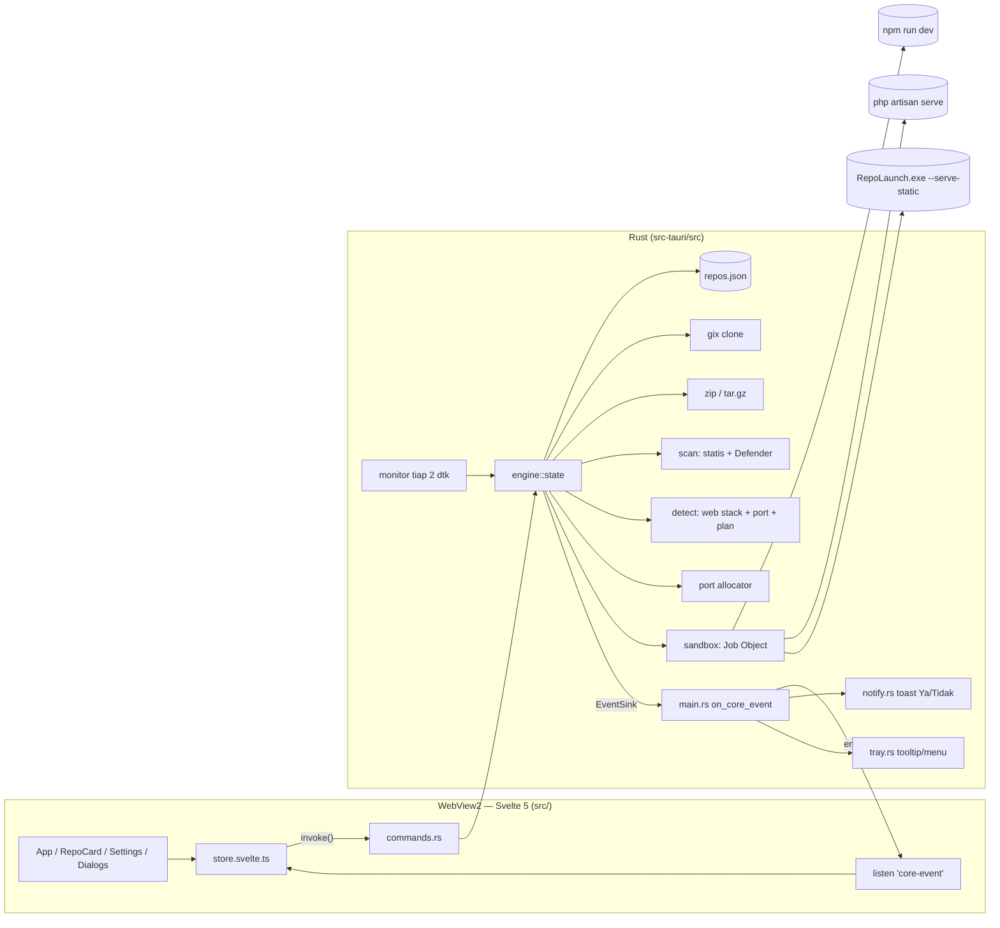
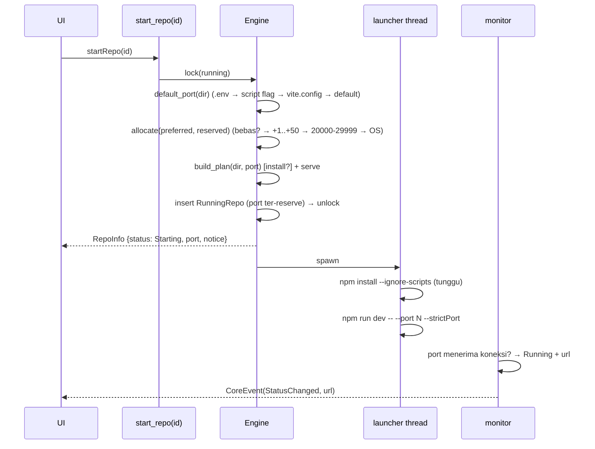

# RepoLaunch — Blueprint Arsitektur

> Nama alternatif: **PortPilot**, **RepoDock**, **LaunchBay**.

## 1. Gambaran besar

Aplikasi desktop Windows berbasis **Tauri 2**: satu executable berisi core Rust (proses, port, scan,
monitor, tray, toast) dan UI **Svelte 5 + TypeScript** yang dirender WebView2.

**Kenapa Tauri (bukan Flutter)?**

| Aspek | Tauri 2 |
|---|---|
| Core Rust | dipanggil langsung sebagai command — tanpa FFI bridge/codegen/cargokit |
| Ukuran installer | ~5–10 MB (WebView2 bawaan Windows 11) |
| RAM idle | ~40–80 MB |
| Tray & toast | tray built-in; toast ber-aksi dikirim dari Rust → tetap jalan saat jendela tersembunyi |
| Domain | aplikasi untuk repo **web** → UI web cocok & mudah dikembangkan |



**Prinsip utama**

| Prinsip | Implementasi |
|---|---|
| Rust = sumber kebenaran | Semua state proses, port, dan PID hanya ada di Rust. UI hanya cache tampilan. |
| UI tidak pernah mengirim PID / perintah / URL | Command hanya menerima `id` repo. Apa yang dieksekusi diputuskan Rust dari allowlist; link dibuka lewat `open_repo_url(id)`. |
| Push, bukan polling | Status & metrik dikirim lewat event Tauri `core-event`. |
| Efek penting di Rust | Toast resource & tooltip tray dikerjakan Rust → tetap bekerja saat jendela di tray. |
| RAII untuk proses | `Sandboxed` di-drop ⇒ seluruh pohon proses mati. Crash app pun mematikan anak (KILL_ON_JOB_CLOSE). |
| CSP ketat | `default-src 'self'`; hanya izin plugin `dialog:allow-open`. |

## 2. Struktur direktori

```text
repolaunch/
├── package.json · vite.config.ts · svelte.config.js · tsconfig.json · index.html
├── src/                              # UI (Svelte 5 runes)
│   ├── main.ts · App.svelte · app.css
│   ├── dev-mock.ts                   # IPC tiruan untuk `npm run dev` di browser (tidak ikut build)
│   ├── lib/
│   │   ├── types.ts                  # cermin DTO Rust (camelCase)
│   │   ├── api.ts                    # pembungkus invoke() bertipe
│   │   ├── store.svelte.ts           # state reaktif + listener core-event + toast in-app
│   │   └── dialogs.svelte.ts         # dialog berbasis Promise (scan report, konfirmasi, log)
│   └── components/
│       ├── RepoCard · Meter · AddRepoDialog · ScanReportDialog
│       ├── LogViewer · SettingsView · ConfirmDialog · Toasts · Modal · Icon
└── src-tauri/
    ├── Cargo.toml · build.rs · tauri.conf.json
    ├── capabilities/default.json     # izin minimum webview
    ├── icons/                        # 32/128/256/512 PNG + icon.ico
    └── src/
        ├── main.rs                   # builder Tauri, mode --serve-static, routing event core
        ├── commands.rs               # command IPC (berat → spawn_blocking)
        ├── tray.rs                   # tray icon/menu, minimize & close ke tray
        ├── notify.rs                 # toast WinRT dengan tombol Ya/Tidak
        └── engine/                   # core (independen dari Tauri, bisa `cargo test`)
            ├── state.rs              # Engine: registry, running map, launcher, log reader
            ├── types.rs              # DTO (serde camelCase)
            ├── validation.rs · git.rs · archive.rs   # instalasi ke karantina
            ├── detect.rs             # HANYA proyek web + port bawaan + LaunchPlan
            ├── scan.rs               # scan keamanan statis + Windows Defender
            ├── port.rs · sandbox.rs · static_server.rs
            ├── monitor.rs · cache.rs · registry.rs · fsutil.rs
```

Data aplikasi (`%APPDATA%\com.repolaunch.app\`):

```text
repos/<nama>-<id8>/   repo terinstal
.staging/<uuid>/      karantina: clone/ekstrak + scan → di-rename atomik ke repos/
sandbox-tmp/<id>/     TEMP/TMP/TMPDIR privat per repo
cache/{npm,pip}/      cache paket milik app (bukan cache global user)
repos.json  settings.json
```

### Proyek web yang didukung

| Kelompok | Deteksi | Dijalankan dengan | Port bawaan |
|---|---|---|---|
| Node.js | `package.json` + framework web di dependencies/script | `npm/pnpm/yarn/bun run dev|start|serve|preview` + flag port framework | Vite 5173, Next 3000, Angular 4200, Astro 4321, … |
| HTML statis | `index.html` di root/`public`/`dist`/`docs`/`build`/`site` | server statis bawaan (`RepoLaunch.exe --serve-static`) | 8080 |
| PHP / Laravel | `index.php` / `artisan` | `php -S` / `php artisan serve` (+ `composer install --no-scripts`) | 8000 |
| Python | `manage.py`, `FastAPI(`, `Flask(` | venv + `runserver` / `uvicorn` / `flask run` | 8000 / 5000 |

Repo di luar tabel (CLI tool, library, Rust/Go, skrip Python biasa) ditolak saat instalasi:
*"Repo ini bukan proyek web."*
## 3. Alur "Start"



Port diteruskan dengan **env `PORT`** *dan* **flag CLI framework** (Vite/Astro `--port --strictPort`,
Next `-p`, uvicorn/flask `--port`, Django `runserver 127.0.0.1:N`). Jika aplikasi tetap memakai port
lain, `detect_url` membaca log (`Local: http://localhost:5174/`) dan memperbarui link — hanya URL
loopback yang diterima.

## 4. Monitoring & Auto-Kill Notification

```text
           over threshold                 ≥ sustain_secs
  Normal ───────────────▶ Breaching ────────────────────▶ Alerted ──(Ya)────────────▶ Stop
    ▲                        │                              │  ├─(Tidak)───────────▶ Snoozed (snooze_secs)
    └──── back to normal ────┘◀──── back to normal ─────────┘  └─(tanpa respons ≥ auto_kill_after_secs)─▶ AutoKilled
```

* CPU & RAM dijumlahkan untuk **seluruh pohon proses** (npm → node → esbuild), CPU dinormalisasi
  ke 0–100% dari total core.
* Peringatan tidak dikirim selama langkah setup (`npm install` memang berat sementara).
* Notifikasi: toast WinRT dari Rust (`notify.rs`) dengan tombol **"Ya (Hentikan)"** / **"Tidak"**
  (Windows toast actions). Jawaban → `respond_to_alert(id, kill)`.
* Monitor berjalan di thread Rust selama aplikasi hidup — termasuk saat jendela disembunyikan ke tray.
* Kill memakai handle yang dipegang Rust (Job Object milik anak sendiri) — **tidak pernah**
  `kill(pid)` dari angka mentah, jadi aman dari PID reuse.

### System tray (`tray.rs`)

| Aksi | Perilaku |
|---|---|
| Minimize (−) | minimize biasa — jendela **tetap terlihat di taskbar** (default). Opsi `minimizeToTray` menyembunyikannya ke tray |
| Close (X) | disembunyikan ke tray (`closeToTray`, default aktif); jika nonaktif → semua repo dihentikan lalu keluar |
| Klik kiri ikon tray | jendela muncul kembali (unminimize + focus) |
| Klik kanan ikon tray | menu **Buka RepoLaunch · Hentikan semua repo · Keluar** |
| Tooltip | "RepoLaunch — N repo berjalan" (diperbarui tiap perubahan status) |
| Pertama kali ke tray | toast "RepoLaunch tetap berjalan…" (sekali per sesi) |
| Instance kedua dibuka | `single-instance` memunculkan jendela yang sudah ada |
| Repo crash saat jendela tersembunyi | toast info dari Rust |

## 5. Scan keamanan di karantina

Setiap repo baru **dipindai sebelum boleh dijalankan**, saat masih di `.staging/<id>` (karantina).
Tidak ada kode dari repo yang dieksekusi selama scan.

```text
clone / ekstrak ─▶ .staging/<id> ─▶ [1] analisis statis (Rust)  ─┐
                                   [2] Windows Defender (Job)  ─┴▶ verdict
     Clean      → pindah ke workspace, Start normal
     Suspicious → pindah ke workspace + note "Repo ini terdeteksi tidak normal",
                  Start DIBLOKIR (Rust menolak) kecuali pengguna mencentang
                  "Saya memahami risikonya" lalu "Tetap jalankan"
```

**Lapis 1 — analisis statis** (`engine/scan.rs`, read-only):

| Kategori | Contoh aturan | Severity |
|---|---|---|
| Penyamaran file | header `MZ`/`PE` pada `.png`/`.txt`, ekstensi ganda `invoice.pdf.exe`, karakter RTL-override | High |
| Manifest npm | `postinstall` berisi `curl`/`powershell`/`node -e`/URL; script `dev`/`start` memuat LOLBin | High |
| VS Code | `.vscode/tasks.json` dengan `"runOn": "folderOpen"` (auto-run saat folder dibuka) | High |
| Pola kode | PowerShell `-enc`, `IEX (New-Object Net.WebClient)`, `certutil -urlcache`, `curl … \| sh`, `eval(atob(…))`, reverse shell, miner (`stratum+tcp`, xmrig), pencurian kredensial browser/wallet/Discord, autostart (`CurrentVersion\Run`, `schtasks /create`), mematikan Defender, perintah destruktif | High |
| Supply chain | dependensi dari URL/git, `.npmrc` registry lain, pip `--index-url`, node_modules dibawa dalam arsip | Medium |
| Heuristik | blob base64 > 3000 karakter, obfuscator `_0x…`, URL IP mentah, webhook Discord/Telegram, akses `~/.ssh/id_rsa` | Medium |
| Informasi | script lifecycle biasa, file `.exe/.dll/.jar` | Info |

**Lapis 2 — Windows Defender**: `MpCmdRun.exe -Scan -ScanType 3 -File <karantina> -DisableRemediation`,
dijalankan lewat `sandbox::spawn_system` (Job Object, env bersih, prioritas rendah, timeout 180 dtk).
Exit code 2 = ancaman → temuan High. Jika Defender tidak tersedia/digantikan AV lain, hasilnya dicatat
sebagai informasi (tidak memblokir). Bisa dimatikan di Pengaturan → Keamanan.

**Verdict**: `Suspicious` jika ada ≥ 1 temuan High **atau** ≥ 3 jenis aturan Medium.
Hasil disimpan di `repos.json`; bisa dilihat (badge perisai di kartu) dan dipindai ulang dari menu.
Repo dari versi lama (belum pernah dipindai) otomatis dipindai saat pertama kali di-Start.

Batasan: ini heuristik. Scan tidak memeriksa isi dependensi yang diunduh `npm install`/`pip install`
(untuk itu gunakan `npm audit` / `pip-audit`) dan tidak menjamin repo aman 100%.

## 6. Model keamanan

| Ancaman | Mitigasi |
|---|---|
| Command/argument injection via URL git | `gix` (library, tanpa shell); https saja; tolak `-…`, `ext::`, spasi/kontrol, kredensial, query |
| SSRF ke jaringan internal | Tolak localhost, IP privat/link-local/CGNAT, hostname tanpa TLD, `.local`/`.internal` |
| Zip-slip / path traversal | `enclosed_name()`, cek komponen tar, `unpack_in`, symlink/hardlink dilewati |
| Zip/tar bomb | ≤ 200k entri, ≤ 4 GB hasil (dihitung dari byte nyata), arsip ≤ 512 MB |
| File palsu | Validasi ekstensi **dan** magic bytes |
| Repo berisi malware | Scan karantina (statis + Windows Defender) sebelum dieksekusi; repo mencurigakan diblokir dari Start |
| Eksekusi program arbitrer | Allowlist `npm pnpm yarn bun node python php composer` + server statis bawaan; interpreter venv harus di dalam repo (setelah canonicalize) |
| postinstall berbahaya | Default `npm install --ignore-scripts` / `composer install --no-scripts` |
| Server statis bawaan | bind 127.0.0.1, hanya GET/HEAD, path di-canonicalize & wajib di dalam root, tanpa directory listing |
| Webview disalahgunakan | CSP `'self'`, izin plugin minimum, URL eksternal hanya dibuka Rust dari state repo |
| Kebocoran rahasia env | `env_clear()` + allowlist; `GITHUB_TOKEN`, `AWS_*`, dll tidak diteruskan |
| Hapus di luar workspace | `ensure_within` (canonicalize) sebelum setiap penghapusan; `dir_name` di repos.json divalidasi ulang saat load |
| Proses yatim / zombie | Job Object KILL_ON_JOB_CLOSE + TerminateJobObject, RAII drop |
| Resource exhaustion | Affinity, CPU rate hard cap, memory limit, prioritas BELOW_NORMAL, monitor + auto-kill |

**Batasan yang perlu dipahami:** lapisan di atas adalah *containment*, bukan sandbox keamanan penuh —
kode repo tetap berjalan dengan hak user. Untuk repo yang **tidak dipercaya**, tambahkan mode kontainer:

* **WSL2** / **Docker Desktop** (`docker run --rm -p N:N -v repo:/app --read-only --cap-drop ALL …`),
* atau **AppContainer** (`CreateProcessW` + `PROC_THREAD_ATTRIBUTE_SECURITY_CAPABILITIES`).

Karena semua eksekusi melewati `sandbox::spawn`, backend kontainer bisa ditambahkan di satu titik itu.

## 7. Roadmap

* Retry otomatis sekali jika log berisi `EADDRINUSE` (menutup jendela TOCTOU port).
* `CREATE_SUSPENDED` + assign Job + resume (menutup race spawn→assign).
* Update repo (`git pull` via gix), dukungan repo privat via token dari secure storage.
* Opsi autostart saat login Windows (`tauri-plugin-autostart`), start langsung ke tray.
* Grafik riwayat CPU/RAM (sparkline) per repo.
